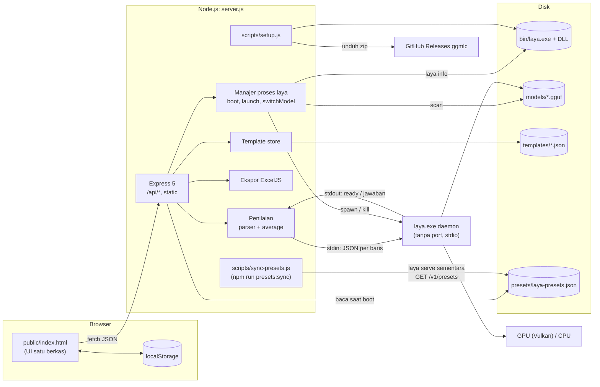
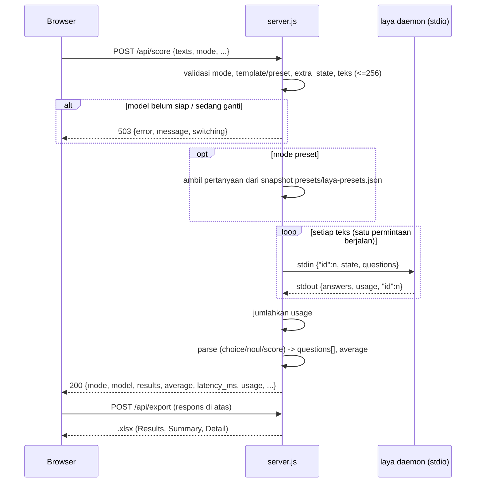
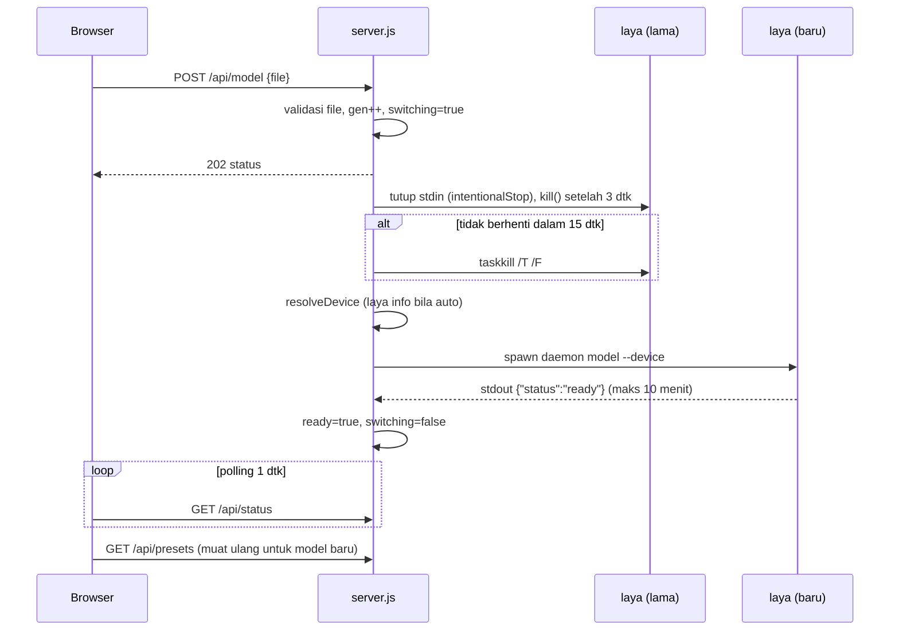

# Arsitektur

> Status: Draft
> Terakhir diperbarui: 2026-09-29
> Pemilik: _TBD_

## Ringkasan

Tiga proses/komponen berjalan di satu mesin: browser yang memuat `public/index.html`, server Node (`server.js`) yang menyajikan UI dan API `/api/*`, serta proses anak `laya.exe daemon` yang memuat model GGUF dan menjalankan inferensi di GPU melalui Vulkan. Server Node berbicara ke laya lewat stdin/stdout (JSON per baris), sehingga satu-satunya port yang dibuka aplikasi adalah port web ([ADR-010](11_DECISIONS.md#adr-010-laya-daemon-via-stdio-alih-alih-serve)). Template disimpan sebagai berkas JSON, definisi preset sebagai snapshot `presets/laya-presets.json`; tidak ada basis data.

## Diagram komponen

## Sekuens penilaian

## Sekuens penggantian model

## Alur data

1. **Input**: teks dari kolom input dipangkas, yang kosong dibuang, lalu dikirim sebagai `texts[]`.
2. **State**: mode sentimen memakai state `{text: t}`. Mode preset/custom memakai `{...extra_state (tanpa nilai ""), [state_key]: t}`.
3. **Pertanyaan**: mode sentimen mengirim satu pertanyaan `sentiment`. Preset/custom mengirim pertanyaan template, ditambah `sentiment` (`sentiment3`) jika `include_sentiment`.
4. **Normalisasi**: jawaban laya diubah menjadi field sentimen tingkat atas (`label`, `score`, `value`, `confidence`, `act`, `options`) dan `questions[]` generik ([04_TRD.md](04_TRD.md#normalisasi-ke-bentuk-pertanyaan-generik)).
5. **Agregasi**: `average` dihitung dari semua hasil.
6. **Ekspor**: frontend mengirim balik respons utuh ke `/api/export`; server tidak menyimpan hasil.
7. **Persistensi**: hanya `templates/*.json` dan snapshot `presets/laya-presets.json` (server) dan beberapa kunci `localStorage` (browser). Pilihan model hanya di memori.

## Keputusan kunci

| Keputusan | ADR |
| --- | --- |
| Build Vulkan laya | [ADR-001](11_DECISIONS.md#adr-001-memakai-build-vulkan-laya) |
| GPU diskrit dipilih otomatis lewat `laya info` | [ADR-002](11_DECISIONS.md#adr-002-pemilihan-gpu-diskrit-otomatis-lewat-laya-info) |
| Fallback port dan `http.createServer` | [ADR-003](11_DECISIONS.md#adr-003-fallback-port-dan-httpcreateserver) |
| Endpoint batch dengan fallback per teks (digantikan ADR-010) | [ADR-004](11_DECISIONS.md#adr-004-endpoint-batch-dengan-fallback-per-teks) |
| Template sebagai berkas JSON, bawaan hanya-baca | [ADR-005](11_DECISIONS.md#adr-005-template-sebagai-berkas-json-bawaan-hanya-baca) |
| `extra_state` untuk preset | [ADR-006](11_DECISIONS.md#adr-006-extra_state-untuk-preset) |
| Field extra kosong tidak dikirim | [ADR-007](11_DECISIONS.md#adr-007-field-extra-kosong-tidak-dikirim) |
| `scale5` eksperimental | [ADR-008](11_DECISIONS.md#adr-008-scale5-ditandai-eksperimental) |
| Frontend satu berkas offline | [ADR-009](11_DECISIONS.md#adr-009-frontend-satu-berkas-offline) |
| laya daemon via stdio alih-alih serve | [ADR-010](11_DECISIONS.md#adr-010-laya-daemon-via-stdio-alih-alih-serve) |
